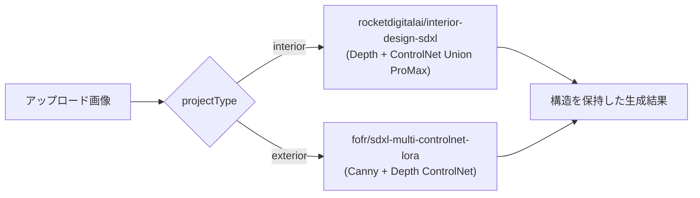

# AIパース構造保持精度向上プラン

このツールは販売用ではなく**社内専用**として品質を極める方針。コスト（Replicate/OpenAI利用料）よりも生成品質を優先する。

以下のフェーズで進める。フェーズ0（UI簡略化）とフェーズ1（作風統一）を先に着手し、フェーズ2（構造保持）はその後、参考画像スタイル指定（フェーズ3）は写真共有後に別途検討する。

- **バグ修正・不要機能削除**（最優先） — 履歴にアップロード画像が残らない不具合の修正、画面暗転（ダークモード切替）機能の削除
- **フェーズ0: UI簡略化・社内ツール化** — 商売文言の削除、`/render`のスタイル選択廃止、自由記述プロンプト追加
- **フェーズ1: 作風統一（ダサさ・模造感の排除）** — `/render` `/staging` `/edit` 共通
- **フェーズ2: 構造保持精度向上（ControlNet導入）** — `/render` のみ
- **フェーズ3（保留）: 参考画像ベースのスタイル指定** — 参考写真共有後に検討

---

## バグ修正・不要機能削除

### 1. 履歴にアップロード画像（Before）が残らない不具合

原因: [hooks/use-history.ts](../hooks/use-history.ts) の `HistoryEntry` は生成結果画像の `url` のみを保存しており、アップロードした元画像（Before）は保存対象になっていない。

```ts
export interface HistoryEntry<TParams> {
  id: string;
  url: string;
  params: TParams;
  createdAt: string;
}
```

そのため、履歴から過去の生成結果を選ぶと `resultImage` は復元されるが `uploadedImage`（Before側）は復元されず消えたままになる。

修正方針:
- `HistoryEntry` に `beforeUrl: string` を追加し、`addEntry` がBefore画像も一緒に保存するようにする
- [app/render/page.tsx](../app/render/page.tsx) / [app/staging/page.tsx](../app/staging/page.tsx) / [app/edit/page.tsx](../app/edit/page.tsx) の3ページで:
  - `addEntry(data.output, { ... })` → `addEntry(data.output, uploadedImage, { ... })` のようにBefore画像を渡す
  - `HistoryPanel` の `onSelect` で `setResultImage(item.url)` に加えて `setUploadedImage(item.beforeUrl)` も呼ぶ
- **注意点**: アップロード画像はdata URL（base64）のため容量が大きく、そのまま履歴（最大20件, localStorage）に保存すると容量超過のリスクがある。保存前に長辺800px程度へリサイズ・再エンコードしてから保存することを推奨する

### 2. 画面暗転機能（ダークモード切替）の削除

`components/nav.tsx` の `<ThemeToggle />`（`next-themes` によるライト/ダーク切り替えボタン）が「画面を暗転できる機能」に該当する。社内ツールでは不要のため削除する。

- [components/nav.tsx](../components/nav.tsx): `<ThemeToggle />` の呼び出しを削除
- [app/layout.tsx](../app/layout.tsx): `ThemeProvider` を `defaultTheme="light"` 固定にし `enableSystem` を外す（OS設定に連動した自動ダークモードも防ぐ）
- `components/theme-toggle.tsx` は呼び出し元がなくなるため削除する

---

## フェーズ0: UI簡略化・社内ツール化

### トップページ（[app/page.tsx](../app/page.tsx)）

社内ツールなので「無料で試す」のような販売・トライアル文言は不要。CTA周りの語彙を社内ツールらしい表現に見直す。

- `無料で試す` → 例: `AIパース生成を開く`
- `試してみる →` / `AIパースを試す →` → 例: `開く →` / `使う →`
- ヒーロー文言（「誰でも正確に生成指示ができる建築家のためのAIツール」等）も、外部向け訴求ではなく社内向けの説明的な文言に調整する

### AIパース生成ページ（[app/render/page.tsx](../app/render/page.tsx)）

現在は「用途」「スタイル（6種：フォトリアル・モダン・和風・ミニマリスト・インダストリアル・北欧）」「ライティング」「素材」「変換強度」を選ぶUIになっている。

```ts
const STYLES: { value: Style; label: string; desc: string }[] = [
  { value: "realistic", label: "フォトリアル", desc: "写真品質" },
  { value: "modern", label: "モダン", desc: "直線・ミニマル" },
  { value: "japanese", label: "和風", desc: "侘び寂び" },
  { value: "minimalist", label: "ミニマリスト", desc: "余白重視" },
  { value: "industrial", label: "インダストリアル", desc: "素地感" },
  { value: "nordic", label: "北欧", desc: "ナチュラル" },
];
```

「モダン」「和風」等の汎用AIスタイル選択は、自社の作風（フェーズ1のガードレール）と競合し、狙った作風から外れる原因になる。そのため:

- **スタイル選択UIを削除**する。生成は常に「フォトリアル + 自社作風ガードレール（フェーズ1）」がベースになる
- 代わりに、**任意入力の「AIプロンプト」自由記述欄**（`Textarea`、`/edit`ページの実装と同様）を追加し、必要な時だけ追加条件（例:「窓を大きく」「北側からの光」等）を書けるようにする
- 「用途（内観/外観）」「ライティング」「素材」「変換強度」のUIはそのまま維持

### プロンプト生成ロジック（[lib/prompt-builder.ts](../lib/prompt-builder.ts)）

- `RenderParams` から `style: Style` を削除し、代わりに任意の `customPrompt?: string` を追加
- `buildPrompt()` は常に `"photorealistic architectural render"` を基点にし、`STYLE_GUARDRAIL_POSITIVE`（フェーズ1）・ライティング・素材を組み立てたあと、`customPrompt` が指定されていればそれを末尾に追加する
- `Style` 型・`styleMap` は未使用になるため削除する

### API・呼び出し側

- [app/api/render/route.ts](../app/api/render/route.ts): リクエストボディから `style` を受け取らず、代わりに `customPrompt` を受け取って `buildPrompt` に渡す

---

## フェーズ1: 作風統一（ダサさ・模造感の排除）

### 目指す作風・避けたい表現

ヒアリング結果:
- 避けたい: 原色・派手すぎる配色、時代遅れ（平成初期風）なデザイン、「〜風」と分かるような模造・ダミー素材表現（偽の木目調ビニールなど）、宮殿やシャンデリアのような過剰に豪華でギラギラした素材
- 目指したい: 建築設計事務所が素材を誠実に扱うような、落ち着いた本物感のある作風

### 実装方針

`lib/prompt-builder.ts` に共通の「作風ガードレール」テキスト（ポジティブ文・ネガティブ文）を定数として追加し、3ツールすべてから参照する。

```ts
export const STYLE_GUARDRAIL_POSITIVE =
  "honest and refined use of materials, tasteful architectural material palette, understated elegant design, natural authentic textures";

export const STYLE_GUARDRAIL_NEGATIVE =
  "garish oversaturated colors, neon colors, kitsch, outdated 1990s interior design, cheap fake imitation material texture, printed faux wood grain, plastic laminate imitation, gaudy ornate gold decoration, chandelier, palace-like opulence, tacky bling";
```

- [lib/prompt-builder.ts](../lib/prompt-builder.ts): `buildPrompt()` の末尾に `STYLE_GUARDRAIL_POSITIVE` を追加、`buildNegativePrompt()` に `STYLE_GUARDRAIL_NEGATIVE` を追加
- [app/api/render/route.ts](../app/api/render/route.ts): 既に `buildPrompt`/`buildNegativePrompt` 経由のため自動的に反映される
- [app/api/staging/route.ts](../app/api/staging/route.ts): 独自の `stylePromptMap` とインラインの `negative_prompt` 文字列があるため、`prompt-builder.ts` から `STYLE_GUARDRAIL_POSITIVE` / `STYLE_GUARDRAIL_NEGATIVE` をimportして追記する
- [app/api/edit/route.ts](../app/api/edit/route.ts): OpenAI `images.edit` は negative prompt非対応のため、`fullPrompt` に `STYLE_GUARDRAIL_POSITIVE` および「避けたい表現」をポジティブな指示文に変換して追記する（例: "avoid garish colors, fake imitation materials, and gaudy ornate decoration"）

### 検証方法

3ツールそれぞれで実際に生成し、派手な配色・模造素材感・過剰装飾が出にくくなっているかを目視確認する。

---

## フェーズ2: 構造保持精度向上（ControlNet導入、`/render`のみ）

### 現状の原因

`/render`（画面上の表示名「AIパース生成」）は現在、汎用の SDXL img2img（`stability-ai/sdxl`）だけを使っている。

```ts
const output = await replicate.run(
  "stability-ai/sdxl:7762fd07cf82c948538e41f63f77d685e02b063e37291fae17e408b9b3a1a4a4",
  {
    input: {
      prompt,
      negative_prompt: negativePrompt,
      image,
      strength,
      num_inference_steps: 30,
      guidance_scale: 7.5,
      width: 1024,
      height: 1024,
    },
  }
);
```

プレーンなimg2imgには構造を固定する仕組みがなく、`strength`（変換強度）を上げるほど壁・窓の位置や遠近感（パース）が崩れる。これが「構造・パースが変換後に崩れる」問題の直接原因。

対して `/api/staging` はすでに `adirik/interior-design`（segmentation + MLSDのControlNet併用）を使っており、レイアウトが比較的保持される。`/render` にも同種の構造固定機構を導入する。

### 方針: interior/exteriorで専用モデルに分岐（精度優先で分割）

「精度が上がるなら分けてよい」という方針のもと、`/render` を1つの汎用モデルにまとめるのではなく、既存の `projectType`（内観/外観）選択に応じて**バックエンドのモデルを分岐**させる。interior専用の特化モデルの方が構造保持・写実性ともに精度が高いため。

- **interior（内観）**: `rocketdigitalai/interior-design-sdxl` — RealVisXL V5.0 + Depth ControlNet + ControlNet Union SDXL ProMax。室内の壁・窓・パースを固定しつつ、写実性の高い質感表現が可能
- **exterior（外観）**: `fofr/sdxl-multi-controlnet-lora` — Canny + Depth の Multi-ControlNet。外観建築の構造保持に対応する汎用モデル（interior向けの専用モデルは無いため）



### 実装変更点

1. [app/api/render/route.ts](../app/api/render/route.ts)
   - `projectType` の値に応じて呼び出すReplicateモデルを分岐させる（interior→専用モデル、exterior→汎用ControlNetモデル）
   - 各モデルのパラメータ名の違い（例: `prompt_strength` vs `denoise`、ControlNet conditioning scaleの引数名）を吸収する薄いアダプター関数を用意する
   - 入力画像を img2img のベースとして渡すと同時に、構造保持用の画像（depth/canny等、モデルが内部で自動生成する場合はそのまま元画像を渡すだけでよい）を渡す
   - `prompt_strength`（style変化量）と `controlnet_conditioning_scale`（構造保持強度）を別々のパラメータとして受け取り、リクエストボディに追加
   - 既存の `useFileOutput: false` 設定は維持

2. [lib/prompt-builder.ts](../lib/prompt-builder.ts)
   - `buildNegativePrompt()` に構造崩れ防止のワードを追加（例: "changed layout, warped walls, shifted windows, distorted perspective, inconsistent architecture"）
   - `buildPrompt()` に構造保持を促す一文を追加（例: "same room layout and camera angle, architecture preserved"）

3. [app/render/page.tsx](../app/render/page.tsx)
   - 現行の「変換強度」スライダー（`strength`）は素材・雰囲気の変化量として残す
   - 新たに「構造保持強度」スライダー（ControlNet conditioning scale, 0.4〜1.0, 初期値0.75程度）を追加し、壁・窓・パースをどこまで厳密に固定するかを独立して調整可能にする
   - 2つのスライダーの役割をUI上のヘルプテキストで明確に区別（「変換強度＝質感・雰囲気」「構造保持強度＝壁・窓・パースの固定度」）
   - `projectType`（内観/外観）の切り替えUIは既存のものをそのまま使い、裏側のモデル分岐は利用者には見せない（体験は変えない）

### 検証方法

- interior/exteriorそれぞれで実際の写真を使い、変換強度を高めに設定した場合でも壁・窓の位置とパースが保持されることを目視確認
- interior側は既存の`stability-ai/sdxl`および汎用ControlNet案との生成結果比較で、専用モデルの精度優位性を確認する
- 生成コスト・生成時間は社内用途のため許容（品質優先）

### リスク・注意点

- 2種類のモデルを保守することになるため、パラメータ差分の吸収ロジック（アダプター）が必要
- 各モデルの入出力パラメータ名は実装時に最新のAPIスキーマで再確認する必要がある（Web情報のみで確認したため）
- `rocketdigitalai/interior-design-sdxl` は空室・家具ありどちらの室内写真にも対応する想定だが、実写真での精度は実装時に要検証

---

## フェーズ3（保留）: 参考画像ベースのスタイル指定

自社の好みに近い施工事例・参考画像を後日共有してもらった上で検討する。テキストプロンプトだけでは「建築設計事務所らしい誠実な素材表現」を完全には表現しきれないため、参考画像をAIに直接渡してスタイルを模倣させる仕組み（IP-Adapter等の画像プロンプト機構）の追加が候補。

- 対象候補モデル: SDXL/FLUX 系のIP-Adapter対応モデル（Replicate上で要調査）
- ControlNet（構造保持・フェーズ2）と IP-Adapter（スタイル参照）を併用することで、「構造は元画像を保持しつつ、質感・雰囲気は参考画像に寄せる」という理想形が実現できる可能性がある
- 参考画像を受領した時点で、具体的なモデル選定・実装方式を別途検討する
