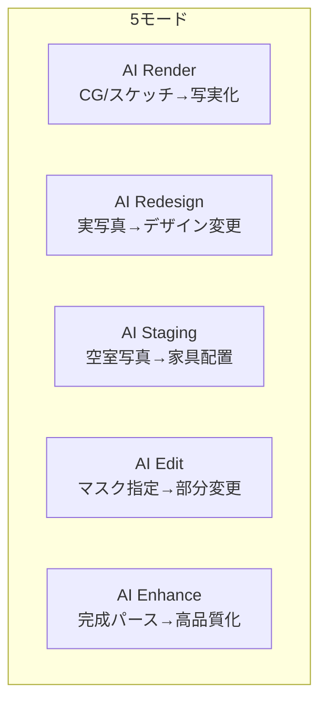
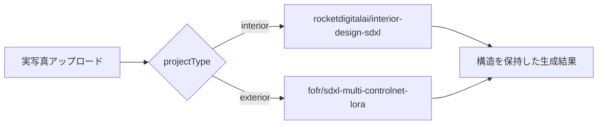

# 5モード再編・品質改善プラン

このツールは販売用ではなく**社内専用**として品質を極める方針。コスト（Replicate/OpenAI利用料）よりも生成品質を優先する。「分けた方が精度・分かりやすさが上がるなら分ける」方針のもと、現行3モードを5モードに再編する。

## モード構成（現行3 → 新5）

- **AI Render**（`/render`、既存route改修） — SketchUp/CGをアップロード → 写実化。入力はCG/スケッチなど非写真素材
- **AI Redesign**（`/redesign`、新規） — 建物・室内の実写真をアップロード → デザイン変更。旧プランで検討していた「構造保持のためのinterior/exterior専用モデル分岐」はこちらに移設
- **AI Staging**（`/staging`、変更なし） — 空室写真をアップロード → 家具配置
- **AI Edit**（`/edit`、変更なし） — 画像をブラシで範囲指定 → 部分変更
- **AI Enhance**（`/enhance`、新規） — 完成したパース（CG下書き〜AI生成結果まで）をアップロード → 高品質化・高解像度化

CG入力（Render）と実写真入力（Redesign）を分ける理由: 入力の性質が根本的に異なる（CGは線がクリーンで構造情報を抽出しやすい／実写真はノイズ・レンズ歪み・照明のばらつきがある）ため、それぞれに適したモデル・パラメータ既定値が異なる。1つのツールに無理に統合すると、どちらかの精度が犠牲になる。



---

## AI Render（`/render`）— CG/スケッチ専用に整理

- 対象入力: SketchUp/CGレンダリング、手描きスケッチなど非写真素材
- 目的: 構造（設計意図）を厳密に保ったまま、質感・光・素材を写実的に変換する
- モデル方針: CGは線が明瞭なため Canny ControlNet が効きやすい。既存の `stability-ai/sdxl`（プレーンimg2img）から、Canny系ControlNetを組み込んだパイプラインに切り替える（候補は後述のRedesignと同系統だが、CG向けにデフォルト強度・プロンプトを調整）
- UI: 用途（内観/外観）・ライティング・素材・変換強度・任意プロンプト欄（スタイル選択UIは廃止 — モダン/和風等のプリセットは自社作風ガードレールと競合するため）

---

## AI Redesign（`/redesign`、新規）— 実写真のデザイン変更

- 対象入力: 既存建物・室内の実写真
- 目的: 壁・窓・パースなどの構造を保持したまま、素材・色・雰囲気を変更する
- モデル方針: `projectType`（内観/外観）で専用モデルに分岐（精度優先で分割）
  - **interior**: `rocketdigitalai/interior-design-sdxl` — RealVisXL V5.0 + Depth ControlNet + ControlNet Union SDXL ProMax。構造保持・写実性ともに高精度
  - **exterior**: `fofr/sdxl-multi-controlnet-lora` — Canny + Depth の Multi-ControlNet（exterior専用モデルは無いため汎用ControlNetモデルを使用）
- UI: AI Renderと同様の構成（用途・ライティング・素材・変換強度・構造保持強度・任意プロンプト、スタイル選択UIなし）



### 実装変更点

1. `app/api/redesign/route.ts`（新規）
   - `projectType` に応じてReplicateモデルを分岐
   - 各モデルのパラメータ差分（`prompt_strength` vs `denoise` 等）を吸収するアダプター関数を用意
   - `prompt_strength`（style変化量）と `controlnet_conditioning_scale`（構造保持強度）を別パラメータとして受け取る
2. `lib/prompt-builder.ts`
   - `buildNegativePrompt()` に構造崩れ防止のワードを追加（"changed layout, warped walls, shifted windows, distorted perspective"等）
   - `buildPrompt()` に構造保持を促す一文を追加
3. `app/redesign/page.tsx`（新規）
   - 「変換強度」（質感変化量）と「構造保持強度」（ControlNet conditioning scale, 0.4〜1.0）の2スライダーを分離して用意

### リスク・注意点

- 2種類のモデルを保守することになるため、パラメータ差分の吸収ロジックが必要
- 各モデルの入出力パラメータ名は実装時に最新のAPIスキーマで再確認する必要がある

---

## AI Enhance（`/enhance`、新規）— 完成パースの高品質化

- 対象入力: 完成したパース全般。CGの下書き的な粗い絵から、AI Render/Redesignで生成した結果までを幅広く想定（今回のヒアリングで「両方のケースに対応したい」と確認済み）
- モデル: `philz1337x/clarity-upscaler`（SDXLベースのアップスケーラー、`creativity`と`resemblance`を独立して調整可能）
- UI:
  - 画像アップロード
  - `creativity` スライダー（低=元画像に忠実、高=AIが詳細を創造的に追加）
  - `resemblance` スライダー（元画像への忠実度・構造保持）
  - スケール倍率選択（2x/4x）
  - プリセットボタン: 「下書きを高品質化」（creativity高め・resemblance低め）／「解像度だけ上げる」（creativity低め・resemblance高め）
- コスト: Clarity系アップスケーラーは概ね $0.03/出力メガピクセル程度（要最新確認）

---

## 共通の横断対応

### バグ修正: 履歴にアップロード画像（Before）が残らない不具合

原因: `hooks/use-history.ts` の `HistoryEntry` は生成結果画像の `url` のみを保存しており、アップロードした元画像（Before）は保存対象になっていない。

```ts
export interface HistoryEntry<TParams> {
  id: string;
  url: string;
  params: TParams;
  createdAt: string;
}
```

修正方針:
- `HistoryEntry` に `beforeUrl: string` を追加し、`addEntry` がBefore画像も一緒に保存するようにする（5モード全ページに適用）
- 各ページの `HistoryPanel` の `onSelect` で `setResultImage(item.url)` に加えて `setUploadedImage(item.beforeUrl)` も呼ぶ
- **注意点**: アップロード画像はdata URL（base64）で容量が大きいため、保存前に長辺800px程度へリサイズしてから保存することを推奨

### 画面暗転機能（ダークモード切替）の削除

- `components/nav.tsx`: `<ThemeToggle />` の呼び出しを削除
- `app/layout.tsx`: `ThemeProvider` を `defaultTheme="light"` 固定にし `enableSystem` を外す
- `components/theme-toggle.tsx` は呼び出し元がなくなるため削除

### UI簡略化・社内ツール化

- `app/page.tsx`: 「無料で試す」等の販売・トライアル文言を社内ツールらしい表現に修正
- `components/nav.tsx` / `app/page.tsx`: リンク・機能カードを5モード構成に更新（アイコン・説明文もモードごとに用意）

### 作風統一（ダサさ・模造感の排除）

避けたい: 原色・派手すぎる配色、時代遅れなデザイン、「〜風」の模造・ダミー素材表現、宮殿やシャンデリアのような過剰装飾。目指したい: 建築設計事務所が素材を誠実に扱うような、落ち着いた本物感のある作風。

```ts
export const STYLE_GUARDRAIL_POSITIVE =
  "honest and refined use of materials, tasteful architectural material palette, understated elegant design, natural authentic textures";

export const STYLE_GUARDRAIL_NEGATIVE =
  "garish oversaturated colors, neon colors, kitsch, outdated 1990s interior design, cheap fake imitation material texture, printed faux wood grain, plastic laminate imitation, gaudy ornate gold decoration, chandelier, palace-like opulence, tacky bling";
```

`lib/prompt-builder.ts` に共通定数として追加し、Render・Redesign・Staging・Editの4モードから参照する（Enhanceはアップスケールのみのため対象外、ただし荒いディテール追加を避けるため軽いネガティブ指定の追加は検討）。

- `app/api/staging/route.ts`: 独自の `stylePromptMap` と `negative_prompt` に追記
- `app/api/edit/route.ts`: OpenAI `images.edit` は negative prompt非対応のため、`fullPrompt` にポジティブな指示文として追記

---

## ファイル変更まとめ

新規作成:
- `app/redesign/page.tsx`, `app/api/redesign/route.ts`
- `app/enhance/page.tsx`, `app/api/enhance/route.ts`

既存改修:
- `app/render/page.tsx`, `app/api/render/route.ts`（CG専用に整理、interior/exterior分岐ロジックはredesignへ移設）
- `hooks/use-history.ts`（beforeUrl追加）
- `components/nav.tsx`, `app/page.tsx`（5モード構成に更新）
- `components/theme-toggle.tsx`（削除）, `app/layout.tsx`（theme固定）
- `lib/prompt-builder.ts`（style廃止・customPrompt追加・ガードレール定数追加）

---

## 検証方法

- 5モードそれぞれで実際の入力（CG/実写真/空室写真/マスク編集/完成パース）を使い、意図した変換が行われるかを目視確認
- Redesignのinterior/exterior分岐で構造（壁・窓・パース）が保持されることを確認
- Enhanceでcreativity/resemblanceの2軸を変えた際の挙動差を確認

## リスク・注意点

- 5モード化によりコード量・保守対象がroute/page単位で3→5に増加する
- 各新規モデル（`rocketdigitalai/interior-design-sdxl`, `fofr/sdxl-multi-controlnet-lora`, `philz1337x/clarity-upscaler`）の入出力パラメータ名・最新バージョンハッシュは実装時にReplicate上で再確認する
- Enhanceのコスト（$0.03/メガピクセル程度）は他モードより高くなる可能性があるが、社内用途のため品質優先で許容

---

## フェーズ3: 参考画像ベースの作風指定（実装済み・第1段）

社内作風ライブラリ（`/style-library`）に施工事例・好みのパースを登録し、Render / Redesign / Staging 生成時に Vision で作風要約を注入する。構造は既存 ControlNet 経路で保持し、雰囲気・配色・素材感はライブラリ＋任意のセッション参考画像で寄せる。極端なブレ抑制用のネガティブも強度に応じて追加する。

本格的な IP-Adapter 重みや LoRA 学習は、事例セットが揃ったあとの次段（モデル選定・学習パイプライン）とする。
